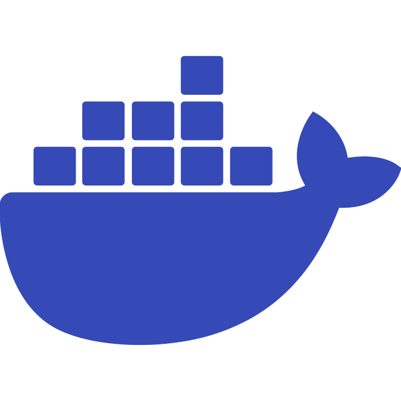

  
   
  
  
### Main Skill:

### Tools:

### Other Knowledge:

<h3 align="center">Contact:</h3>
<a href="mailto: alancapellao@gmail.com" target="_blank">
<a href="https://www.linkedin.com/in/alancapellao/" target="_blank">

  

 
<b>Visitors Count</b>
  

 
 

  

